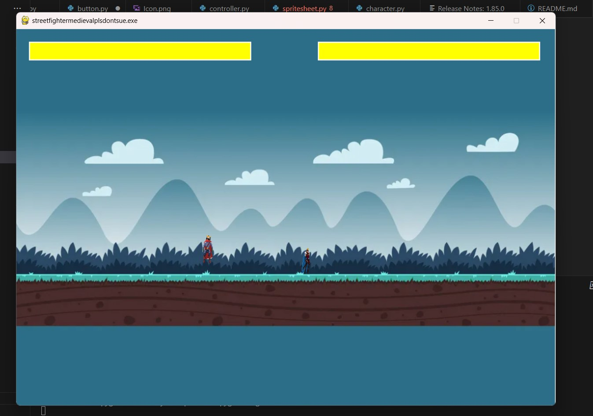

:warning: Everything between << >> needs to be replaced (remove << >> after replacing)

# << Project Title >>
Street Fighter But Medieval

## CS110 Final Project  << Semester, Year >>
Fall 2023

## Team Members
***Vincent You and Eric Li

## Project Description
This is a parody of Street Fighter, but set in Medieval times. In other words, Street Fighter with swords and kings.
It has a round system, a menu, the actual game, an the end of game screen.

## GUI Design
from top to bottom-
Menus, Health bars, and visual graphics 
extras: sound effects, interactive gui, and specific effects
### Initial Design

### Final Design

## Program Design

### Features

1. Movement System
2. Combat System
3. End of Round Screen
4. HUD elements that reflect what happens ingame
5. Start Menu

### Classes

- << You should have a list of each of your classes with a description >>
Controller Class:
    Controls and manages the mainloops as well as other loops i.e. menu, game, round, and gameover loops.

Button Class (from button module):
    Class for buttons with the funcitonality of blitting them onto a surface and returning a value when clicked.

Character Class (from character module):
    Sprite class for players, containing movement, attacks, and animations.

## KNOWN BUGS
1. Animation is not correctly showing when moving, jumping, or attacking.
2. Animation is not correctly flipping so sprites will always face each other (their attacks will flip, not the images)
3. When a new round starts, the sprite images are not reset to their original positions. However, their object itself is (In other words, the sprites are still able to move and attack each other. It's just the images are not reflecting that. You can test this by forcing player 1 to move right while spamming the attack button)

## ATP

Test 1: Menu Navigation
1. Start the program
2. Click button that says 'start'
3. Verify program starts the game
4. Click button that says 'quit'
5. Verify program ends
Expected: Menu correctly displays 'start' button and will start the game when clicked and 'quit' button will end the program.

Test 2: Player Movement
1. Start the game
2. Press 'A' and 'D' key
3. Ensure Player 1 moves left and right respectively
4. Press 'S' key
5. Ensure Player 1 jumps
6. Press 'J' and 'L' key
7. Ensure Player 2 moves left and right respectively
8. Press 'K' key
9. Ensure Player 2 jumps
10. Move Player 2 to Player 1 until they collide
11. Ensure both Players are unable to go through each other
Expected: Player 1 and 2 can move and jump independently of each other and both players cannot phase through each other.

Test 3: Combat System
1. Press 'X' key
2. Ensure Player 1 uses an attack
3. Press 'N' key
4. Ensure Player 2 uses an attack
Expected: Player 1 and 2 are able to attack independently.

Test 4: Health System
1. Move Player 1 to Player 2 so that they collide
2. Attack Player 2 with Player 1
3. Ensure Player 2 takes damage and that it is reflected in Player 2's health bar
4. Repeat, but this time Player 2 attacks
Expected: Player 1 and 2 can attack each other, causing the receiving end to lose health, which is reflected in the health bar

Test 5: Round System
1. As Player 1, attack Player 2 until their health reaches 0
2. Ensure the round ends, with the point going to Player 1
3. Repeat, and ensure the game ends when Player 1 wins again
4. Now repeat, but this time let Player 1 and Player 2 each win one round
5. Let either player win the remaining round
6. Ensure the player with the most round victories wins the game
Expected: Maximum of 3 rounds, with the first player reaching 2 round victories wins the game.

Test 6: Return to Menu
1. Play a full game with either player winning
2. Ensure that at the end of the game, 2 buttons ('replay' and 'exit to menu') appear
3. Click 'replay' button
4. Verify that restarts the game, and then play a full game again
5. Click 'exit to menu' button
6. Ensure the game returns to the menu screen
Expected: At the end of the game, the 'replay' button allows players to replay a game, while the 'exit to menu' button returns to the main menu.

